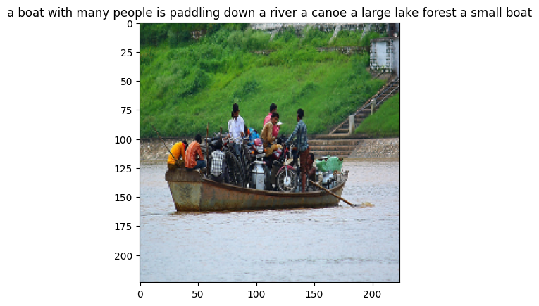

**Project Descriptions**

*
Predicted captions
*

The Flickr30k dataset has emerged as a popular benchmark for image captioning tasks. This dataset comprises over 31,000 images with a total of approximately 158,000 captions. In this repository, we will be using the Flickr30k dataset to train a model for generating captions for images. Additionally, this dataset has been augmented with the Flickr30k Entities, which includes over 244,000 coreference chains that link mentions of the same entities across different captions for the same image. This extension is intended to enable better natural language understanding of the images and is expected to lead to more informative and accurate captions. To get started, you can download the datasets from https://www.kaggle.com/datasets/hsankesara/flickr-image-dataset.